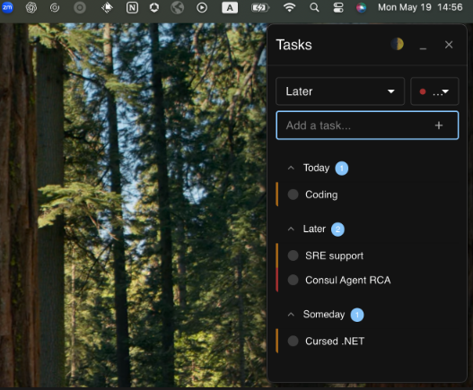

# Todo Electron App

A minimal todo application built with Electron, React, and TypeScript.



## Features

- Simple and clean UI for managing todos
- Create, edit, and delete tasks
- Organize tasks into sections (Today, Later)
- Drag and drop to reorder or move tasks between sections
- Priority levels (Low, Medium, High)
- System tray integration with quick access menu
- Dark/Light mode support

## Installation

### Download Pre-built Application

Download the latest release for your platform from the [Releases page](https://github.com/omergorenn/todo-electron/releases).

### Install from Source

```bash
# Clone the repository
git clone https://github.com/omergorenn/todo-electron.git

# Navigate to the project directory
cd todo-electron

# Install dependencies
npm install

# Start the application in development mode
npm run dev
```

## Building from Source

```bash
# Build the application
npm run build

# Package for your current platform
npm run package

# Package for specific platforms
npm run package:mac    # macOS
npm run package:win    # Windows
npm run package:linux  # Linux

# Package without code signing (for personal/side projects)
npm run package:unsigned      # Current platform, no code signing
npm run package:mac:unsigned  # macOS, no code signing
```

## Distribution

The packaged applications will be available in the `release` directory after running the package commands. These can be distributed to users for installation.

### Notes on Code Signing

For personal or side projects, you can use the unsigned packaging options to avoid code signing with your personal/work certificates. Note that unsigned applications may trigger security warnings on some operating systems.

### Release on GitHub

To publish a new release on GitHub:

1. Update the version in `package.json`
2. Create a GitHub Personal Access Token with `repo` permissions
3. Set the token as an environment variable: `export GH_TOKEN=your_token_here`
4. Run: `npm run release`

## Development

```bash
# Start in development mode
npm run dev

# Build without packaging
npm run build

# Run the built app
npm start
```

## License

ISC 